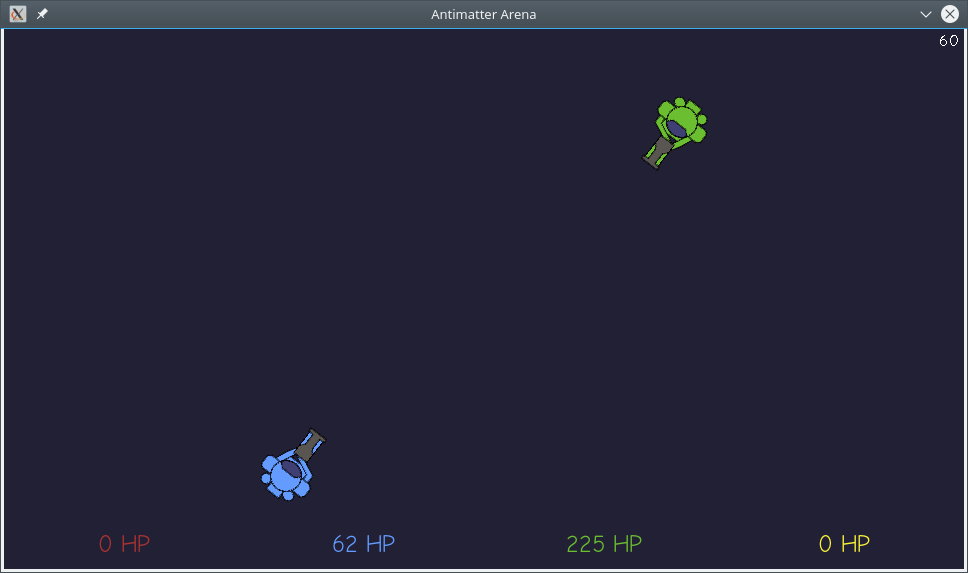

# Antimatter Arena #

**A game created for ludum dare 39.**

Millenia ago, the $SYSTEM_NAME system faced an exitential threat:
A gigantic antimatter cloud was set to collide wit the system,
dissolving all matter in it.

To avert disaster, the $ALIEN_RACE, an ancient and highly advanced
civilization, built a powerful deflector shield that protected the
worlds of $SYSTEM_NAME.

But their guardians have long since vanished, and all knowledge of their
construction has been lost. Without maintenance, the device is slowly
running out of power, weakening the shield and letting more and more
antimatter leak into the system.

Unaware of that, the inhabitants of $REDNECK_PLANET set out to enjoy
their annual gladiator tournament, but the arena, thanks to the
effect of the antimatter, is not structurally sound anymore...

## Dependencies ##

* SDL2
* SDL2_ttf
* SDL2_image
* SDL2_gfx
* googletest

## Compiling ##

    mkdir build
    cd build
    cmake ..
    make
    cp src/antimatter-arena ..

## Licensing ##

### Code ###

All of the game's source code (and the project as a whole) is licensed
under the Apache 2.0 license:

   Copyright 2017 Thomas Glamsch

   Licensed under the Apache License, Version 2.0 (the "License");
   you may not use this file except in compliance with the License.
   You may obtain a copy of the License at

       http://www.apache.org/licenses/LICENSE-2.0

   Unless required by applicable law or agreed to in writing, software
   distributed under the License is distributed on an "AS IS" BASIS,
   WITHOUT WARRANTIES OR CONDITIONS OF ANY KIND, either express or implied.
   See the License for the specific language governing permissions and
   limitations under the License.

See LICENSE.txt for the full license text.

### Art Assets ###

With the exception of the excellent [Comic Neue font](http://comicneue.com),
which was created by Craig Rozynski and released under the
SIL Open Font License 1.1 (see LICENSE-OFL.txt), all art assets are
Copyright (c) 2017 Thomas Glamsch and are provided under the CC0 1.0
Universal license. See LICENSE-CC0.txt for the full license text.

### Others ###

Contents of the cmake/Modules/ directory are based on official CMake
modules and are licensed under a 3-clause BSD license. See
LICENSE-BSD-3-clause.txt for full license terms.

The database of game controller mappings is licensed under the
zlib/libpng license, see LICENSE-Zlib.txt for the full license text.

For a detailed, per-file enumeration, see debian/copyright.
